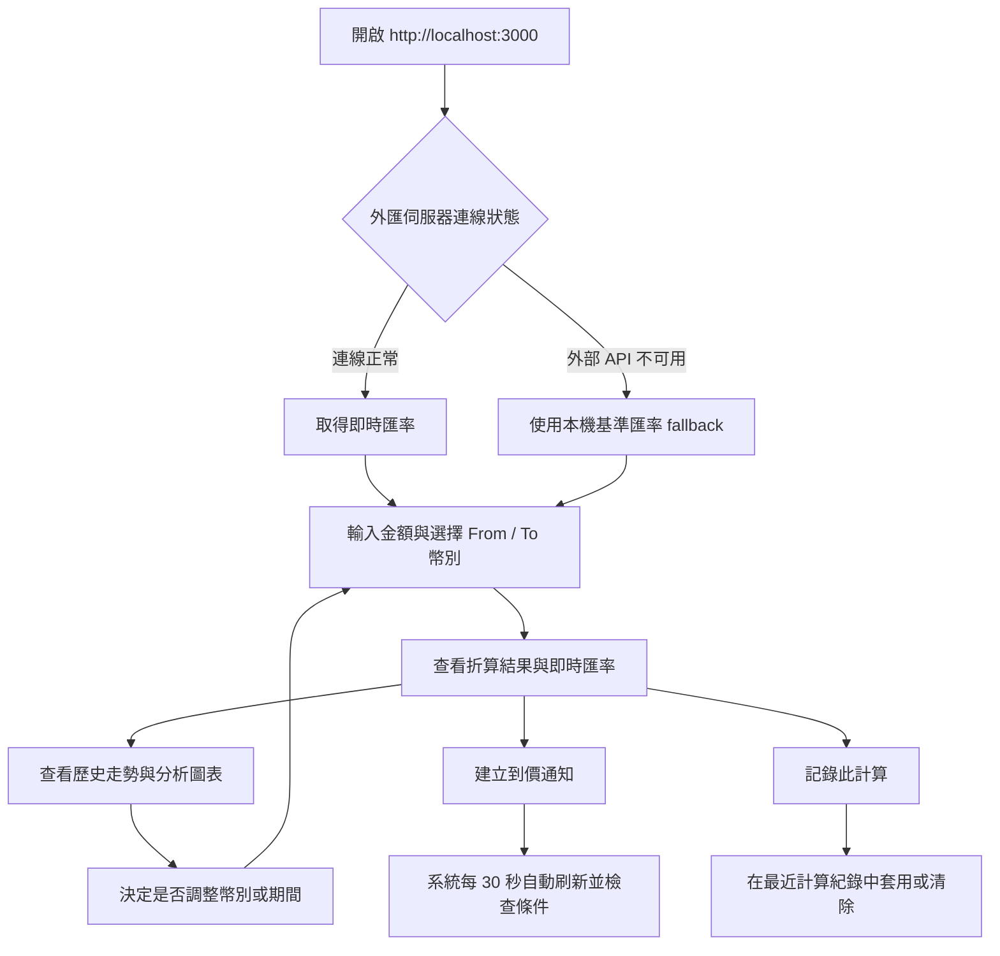
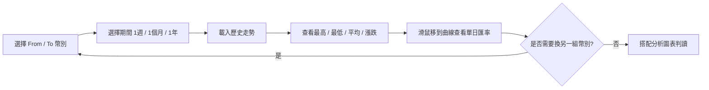
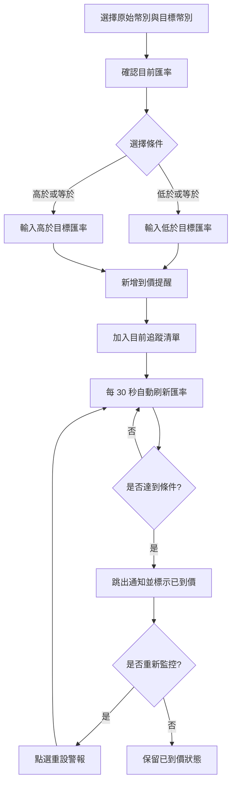

# 換匯走勢小工具使用者操作手冊

「換匯走勢小工具」是一個本機執行的匯率儀表板，用來查詢主要幣別匯率、快速換算金額、查看歷史走勢、建立到價通知，並保存最近的換算紀錄。適合旅遊換匯、跨境付款、外幣資產觀察與日常匯率比較。

> 匯率資料會優先連線取得公開即時匯率；若外部服務暫時不可用，系統會改用內建基準匯率與模擬波動，讓介面仍可操作。所有圖表與提醒僅供參考，實際交易仍以銀行或交易平台報價為準。

## 目錄

- [快速開始](#快速開始)
- [整體操作流程](#整體操作流程)
- [主畫面導覽](#主畫面導覽)
- [進行匯率換算](#進行匯率換算)
- [查看歷史走勢](#查看歷史走勢)
- [使用各國幣別快捷對比](#使用各國幣別快捷對比)
- [使用匯率分析圖表](#使用匯率分析圖表)
- [設定到價通知](#設定到價通知)
- [管理最近計算紀錄](#管理最近計算紀錄)
- [資料更新與離線 fallback](#資料更新與離線-fallback)
- [支援幣別](#支援幣別)
- [常見問題](#常見問題)
- [開發與維護指令](#開發與維護指令)

## 快速開始

### 1. 安裝必要環境

請先安裝 Node.js。建議使用目前仍受維護的 LTS 版本。

### 2. 安裝專案套件

```powershell
npm install
```

### 3. 啟動本機服務

```powershell
npm run dev
```

### 4. 開啟工具

用瀏覽器開啟：

```text
http://localhost:3000
```

啟動後，頁面右上角會顯示外匯伺服器連線狀態；若顯示連線正常，即代表目前可取得匯率資料。

## 整體操作流程



## 主畫面導覽

主畫面分成兩個主要區域：

- 左側主區：即時匯率轉換、歷史走勢圖、各國幣別快捷對比、匯率分析圖表。
- 右側輔助區：到價通知設定、目前追蹤清單、最近計算紀錄。

頁面上方提供兩個狀態與操作：

- 外匯伺服器狀態：顯示目前是否連線正常。
- 手動刷新匯率：立即重新取得匯率並更新換算結果與通知判斷。

## 進行匯率換算

1. 在「原始金額」輸入要換算的金額。
2. 在 From 下拉選單選擇原始幣別。
3. 在 To 下拉選單選擇目標幣別。
4. 系統會即時顯示折算結果。
5. 可使用中間的對調按鈕快速交換 From 與 To。
6. 可點選快捷金額 `100`、`1,000`、`10,000`、`50,000` 快速改變輸入金額。
7. 若想保存本次換算，點選「記錄此計算」。

畫面會同時顯示：

- `1 原始幣別 = 目標幣別匯率`
- `1 目標幣別 = 原始幣別匯率`
- 最後更新時間

## 查看歷史走勢

「歷史走勢圖表」會根據目前選擇的 From / To 幣別顯示匯率曲線。

可切換三種期間：

- `1 週`：短期觀察。
- `1 個月`：預設期間，適合一般換匯判斷。
- `1 年`：長期趨勢觀察。

圖表上方會整理四個數值：

- 最高匯率
- 最低匯率
- 平均匯率
- 區間漲跌

將滑鼠移到圖表上時，會顯示該日期的匯率資料。



## 使用各國幣別快捷對比

「各國幣別快捷對比」會以目前輸入金額與 From 幣別為基準，列出所有支援幣別的即時換算結果。

你可以：

- 在搜尋框輸入幣別代碼或名稱，例如 `USD`、`TWD`、`日圓`。
- 查看每個幣別對目前 From 幣別的匯率。
- 點選「設定目標」直接把該幣別設為 To 幣別。
- 目前 From 幣別會顯示為「基準幣別」。
- 目前 To 幣別會顯示為「對盤中」。

## 使用匯率分析圖表

「匯率分析圖表」提供五種判讀視角。這些圖表是依據目前頁面中的歷史匯率資料計算，不是投資建議。

### 均線趨勢

比較原始匯率、短均線與長均線，用來快速觀察短期走勢是否高於長期走勢。

### 進出場區間

用期間低檔、中段與高檔區間標示目前匯率位置，協助判斷目前是相對低檔、中性或相對高檔。

### 每日波動

以柱狀圖呈現近期每日變動率。綠色代表匯率上升，紅色代表匯率下降。

### 動能儀表

用短均線相對長均線的差距估算動能，並搭配波動率顯示偏弱、盤整或偏強。

### 目標距離

若你已設定到價通知，這裡會顯示目前匯率距離各目標還差多少百分比。若尚未設定通知，系統會用期間低點、均值與高點作為參考。

## 設定到價通知

到價通知可用來追蹤某一組幣別匯率是否達到指定條件。

### 新增提醒

1. 在右側「匯率到價通知」區塊選擇原始幣別。
2. 選擇目標幣別。
3. 查看系統顯示的當前匯率。
4. 選擇觸發條件：
   - `低於 (<=)`：當匯率小於或等於目標值時提醒。
   - `高於 (>=)`：當匯率大於或等於目標值時提醒。
5. 輸入目標匯率數值。
6. 點選「新增到價提醒」。

### 通知觸發後

當條件達成時，畫面上方會跳出通知，該提醒也會在追蹤清單中標示為「已到價」。若想讓已觸發的提醒重新進入監控，可點選「重設警報」。



## 管理最近計算紀錄

當你點選「記錄此計算」後，工具會把本次換算存到「最近計算紀錄」。

紀錄內容包含：

- 原始金額與原始幣別
- 折算後金額與目標幣別
- 當時匯率
- 記錄時間

你可以：

- 點選「套用」：把該筆紀錄的幣別與金額帶回換算器。
- 點選「清除紀錄」：清空目前瀏覽器內保存的所有換算紀錄。

提醒與換算紀錄都保存在瀏覽器的 `localStorage`。同一台電腦、同一個瀏覽器通常會保留資料；若清除瀏覽器資料或改用其他瀏覽器，紀錄不會同步過去。

## 資料更新與離線 fallback

系統更新匯率的方式如下：

- 進入頁面時會自動取得一次匯率。
- 每 30 秒會自動刷新一次匯率，用於更新畫面與檢查到價通知。
- 點選「手動刷新匯率」可立即更新。
- 伺服器端會快取公開 API 回應 10 分鐘，避免過度頻繁呼叫外部服務。
- 若公開 API 無法連線，會使用內建基準匯率與小幅模擬波動，確保換算器仍可使用。

## 支援幣別

| 代碼 | 幣別 |
| --- | --- |
| TWD | 新台幣 |
| USD | 美金 |
| JPY | 日圓 |
| EUR | 歐元 |
| GBP | 英鎊 |
| AUD | 澳幣 |
| CNY | 人民幣 |
| HKD | 港幣 |
| KRW | 韓元 |
| SGD | 新加坡幣 |

## 常見問題

### 為什麼畫面顯示外匯伺服器斷線但仍可換算？

工具有內建 fallback 匯率。當外部匯率 API 暫時失敗時，系統仍會用本地基準值完成換算，但此時結果僅適合參考。

### 歷史走勢是真實歷史資料嗎？

目前歷史走勢是以當前匯率為基準，搭配可重現的模擬曲線產生，用於展示趨勢判讀流程。實際交易或正式決策請查核銀行、券商或匯率資料供應商的歷史資料。

### 到價通知會在我關掉瀏覽器後繼續提醒嗎？

不會。到價通知是在頁面開啟時由瀏覽器端檢查；若關閉頁面或電腦睡眠，就不會持續監控。

### 換算紀錄會上傳到伺服器嗎？

不會。最近計算紀錄與到價通知設定保存在本機瀏覽器的 `localStorage`。

### 可以改用 production 模式執行嗎？

可以。先執行建置，再啟動 production bundle：

```powershell
npm run build
npm start
```

## 開發與維護指令

一般使用者只需要 `npm install` 與 `npm run dev`。以下指令提供給維護者：

| 指令 | 用途 |
| --- | --- |
| `npm run dev` | 啟動 Express + Vite 本機開發服務 |
| `npm run lint` | 執行 TypeScript 型別檢查 |
| `npm test` | 執行匯率分析邏輯測試 |
| `npm run build` | 建置前端並打包 `server.ts` 到 `dist/server.cjs` |
| `npm start` | 執行 production bundle |
| `npm run clean` | 移除 `dist/`；Windows PowerShell 可改用 `Remove-Item -Recurse -Force dist` |
